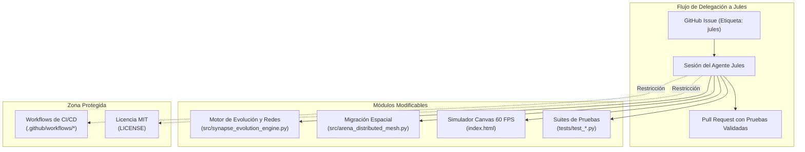

# Reglas de Orquestación y Delimitación para el Agente Jules en Synapse Arena

Este repositorio (`synapse-arena`) implementa un simulador de vida artificial y enjambres cibernéticos a 60 FPS con redes neuronales continuas y algoritmos genéticos.

El agente autónomo **Jules** de Google actúa como programador delegado en la nube para implementar nuevas capacidades sensoriales, optimizaciones de física y visualizaciones.

---

## 🏛️ Mapa de Responsabilidades para Jules



### 1. Áreas de Programación Permitidas:
- `index.html`: Renderizado Canvas, nuevos modos interactivos de simulación, shaders y audio Web Audio.
- `src/synapse_evolution_engine.py`: Mutaciones genéticas, cálculo vectorial y funciones de aptitud.
- `src/arena_distributed_mesh.py`: Serialización genómica y lógica de migración espacial.
- `tests/`: Nuevas pruebas unitarias o de integración.

### 2. Estándar de Pruebas:
Cualquier Pull Request generado por Jules debe pasar limpiamente:
```bash
python -m unittest discover -s tests
```
