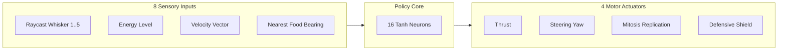

# 🌌 Project Synapse Arena

[](LICENSE)
[](#features)
[](#architecture)
[](AGENTS.md)

An interactive, high-performance **60 FPS Artificial Life Simulator & Cyber-Organism Swarm Arena** running client-side HTML5 Canvas, procedural Web Audio synthesis, and continuous-time neural policy networks.

---

## 🕹️ Live Simulation & Features

- **Continuous Neural Policy Networks:** Each cyber-organism processes 8 continuous raycast sensors through a 16-neuron hidden layer to drive 4 motor outputs (thrust, angular velocity, mitosis, shield).
- **Three Competing Species:**
  - 🔴 **Apex Predators (Crimson):** Fast, aggressive hunters tracking and consuming prey.
  - 🟢 **Herbivore Foragers (Emerald):** Agile grazers collecting ambient quantum energy nodes.
  - 🔵 **Symbiotic Scavengers (Cyan):** Recyclers decomposing decaying matter into free energy.
- **Interactive God-Mode Controls:**
  - 💥 **Trigger Quantum Supernova:** Floods the arena with 110+ high-energy food particles.
  - 🧬 **Induce Radiation Mutation:** Injects Gaussian noise perturbations $\mathcal{N}(0, \sigma^2)$ into living neural weights.
  - ⚡ **Solar Flare (EMP Blast):** Jams organism sensory whiskers by 85% for 5 seconds.
  - 🌌 **Gravitational Singularity:** Drag with the mouse to attract or repel organisms with orbital physics.
  - 🔊 **Procedural Web Audio:** Real-time synthesized sound cues for predation, mitosis, and EMP bursts.
- **Distributed Spatial Migration:** Visual inter-node conduit dividing Sector 01 and Sector 02, seamlessly serializing genomes for distributed multi-machine compute.

---

## 🏛️ Neural Architecture



---

## 🚀 Quickstart

Open `index.html` directly in any modern web browser. Zero build steps or external dependencies required.

### Running Automated Test Suite
```bash
python -m unittest discover -s tests
```

---

## 🤖 Jules Coding Agent Workflow

This repository is integrated with **Google Jules**. Automated issues labeled `jules` trigger cloud-based code generation and pull requests under the guidance of [`AGENTS.md`](AGENTS.md).

---

## 📄 License
Licensed under the [MIT License](LICENSE).
